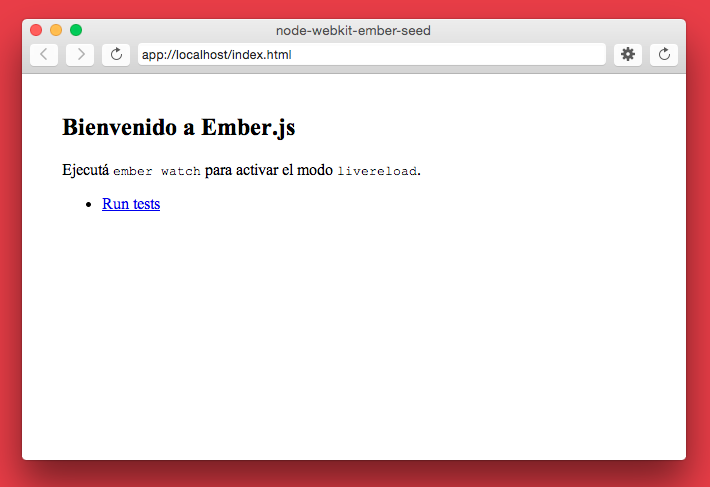

¡Hola, esto es pilas-engine-bloques!
==========================

Este proyecto está construido a partir de nwjs-ember-seed,
un marco de aplicación pensado como punto de partida
para hacer aplicaciones de escritorio usando javascript.

Esta aplicación integra las herramientas [ember](http://emberjs.com/), [ember-cli](http://www.ember-cli.com/)
y [nwjs](http://nwjs.io/) junto a unas configuraciones iniciales
para poder editar código y observar los resultados inmediatamente (livereload).

¿Cómo empezar?
--------------

Al clonar el repositorio, podrías escribir el comando ``make``
para ver las tareas disponibles:

Si tenes instalado nwjs, lo mejor es lanzar el comando
``make mac_test`` y en la misma consola ``make watch`` para
activar el modo livereload.

En cambio, si usas *chrome*, usá el comando ``make server`` y listo :)
