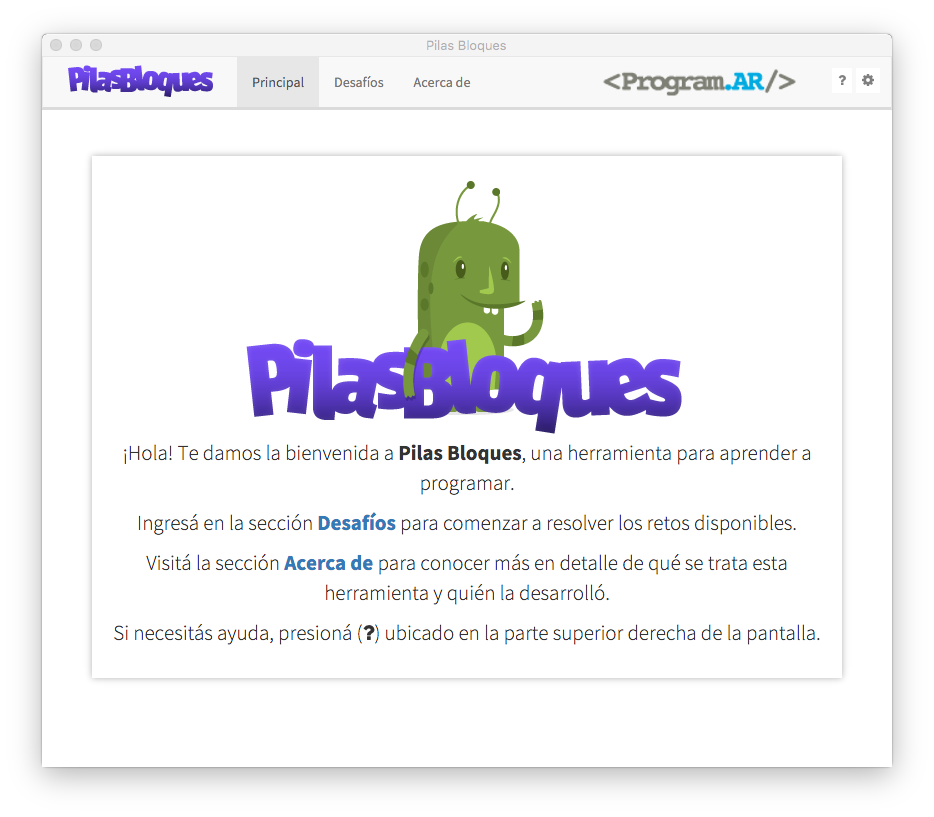
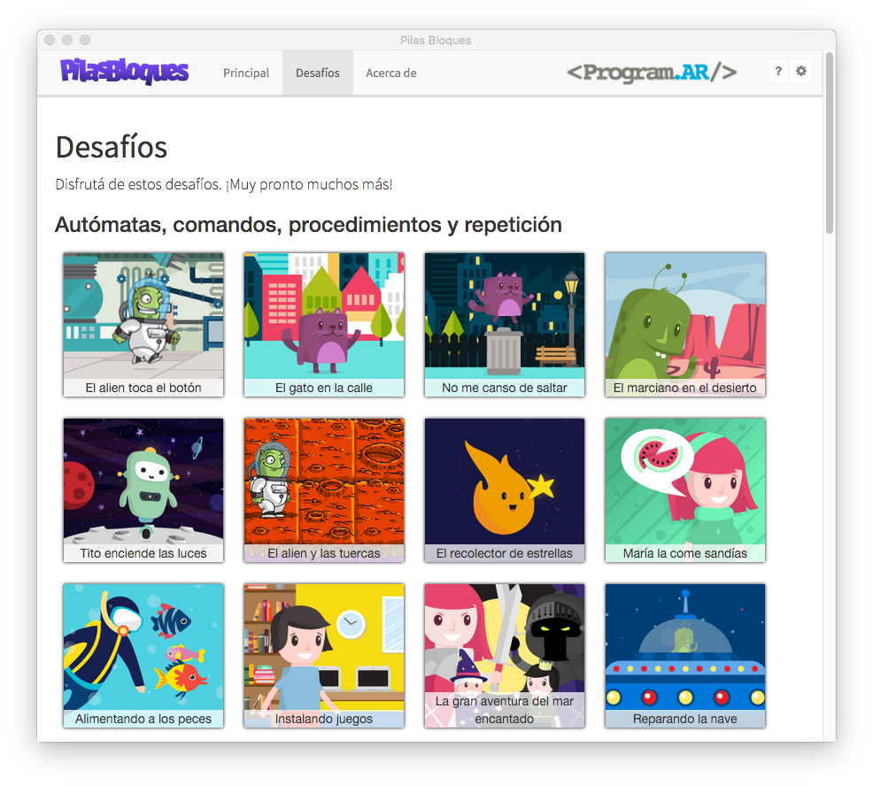
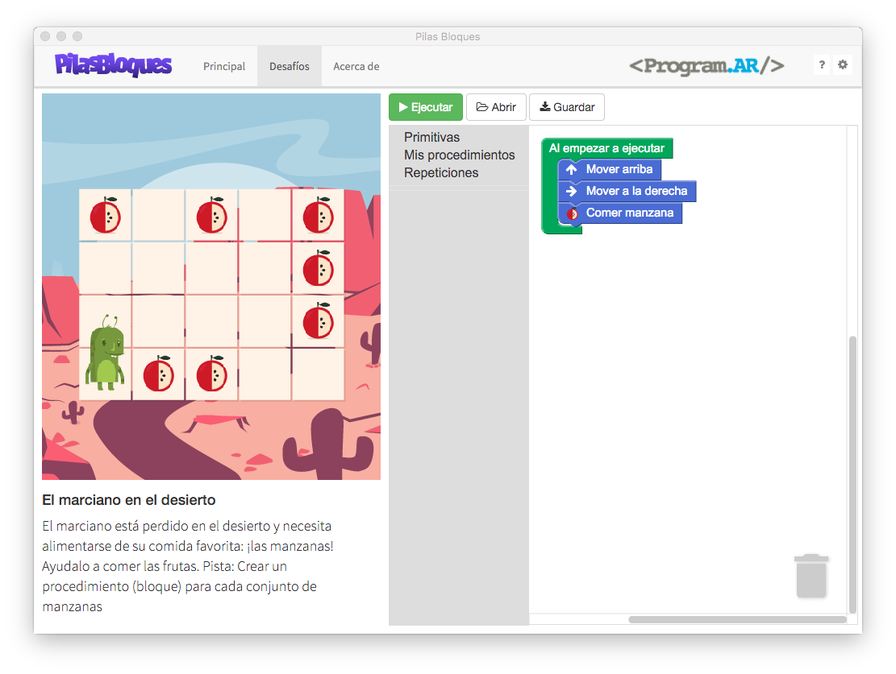
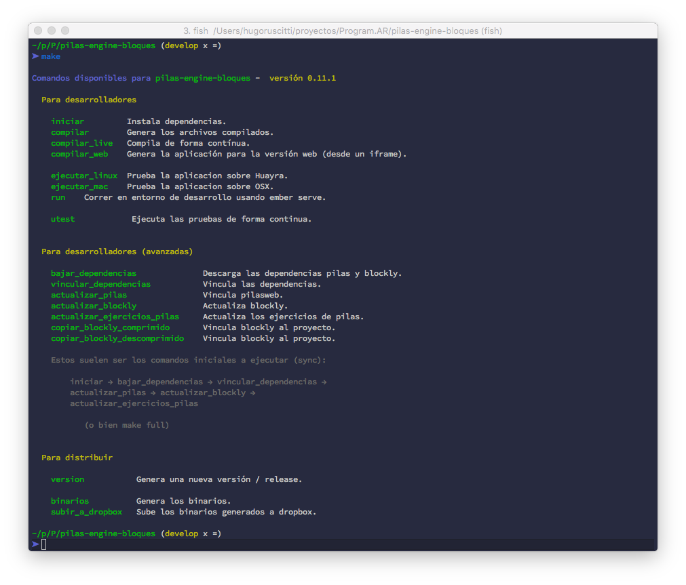

Pilas Bloques
=============

- Issues planificados para este sprint: [](http://waffle.io/Program-AR/pilas-bloques)

- Rama master: [](https://travis-ci.org/Program-AR/pilas-bloques)
- Rama develop (principal): [](https://travis-ci.org/Program-AR/pilas-bloques)

Esta es una versión hermana de [pilas-engine](http://www.pilas-engine.com.ar) pero
utilizando bloques, javascript y desafíos para aprender a programar.





¿Cómo empezar?
--------------

Al clonar el repositorio, podrías escribir el comando ``make``
para ver las tareas disponibles:



Te recomendamos usar una versión estable de node de la rama 4, como 4.5 por ejemplo, ya
que usamos la versión estable de emberjs y [eso recomiendan sus desarrolladores](http://emberjs.com/blog/2016/09/07/ember-node-lts-support.html).

Generalmente, lo que se suele hacer inmeditamente después de clonar
el repositorio es instalar todas las dependencias y poner a funcionar
la aplicación así:

```
make iniciar
make full
ember serve
```


Tests
-----

Para ejecutar los tests de la aplicación hay 3 opciones:

1. Ejecutar los test una sola vez:

```
  ember test
```

2. Ejecutar los tests de forma contínua:


```
  ember test --watch
```

3. Ejecutar los tests lo más rápido posible, usando ejecución en
paralelo:

```
  make test_travis
```

De todas formas, aunque no ejecutes los tests en forma local, en este
proyecto estamos usando travis para que los test se ejecuten siempre
después de cada "push":

https://travis-ci.org/Program-AR/pilas-bloques


Notas de versión
---------

* 1.0.1
 * Migramos la aplicación offline de node-webkit a electron.
 * Mejoras generales en links externos y la integración con el sistema.
 * Haciendo adaptable el diseño visual de la aplicación.

* 1.0.0
 * Incluye todos los desafíos hasta Parametrización Inclusive. Entonces, Pilas Bloques abarca todas las actividades del manual para docentes "La programación y su didáctica" sin el último capítulo (Interactividad).
 * Esto significa... ¡16 nuevas actividades! Con algunas mejoras respecto del manual para docentes. Por ejemplo, una mejora didácticamente importante es que no usamos strings.
 * ¡Ahora se pueden guardar soluciones a un archivo! (Y, por supuesto, cargar una solución desde un archivo)
 * En la propuesta del manual, se usaban "variables" para denotar funciones a falta de una mejor opción en Scratch. En un principio, en Pilas Bloques, se usó ese modelo. Pero ahora fue modificado para proveer un nombre apropiado: "Sensores numéricos".
 * Otra diferencia es que la categoría "Control" fue cambiada por dos categorías, "Repeticiones" y "Alternativas". ¿Por qué? Porque la visión de la programación como control de flujo es una visión _operativa_. Desde Program.AR creemos que la programación puede tener también una visión _declarativa_, que es más importante.
 * Algunas mejoras visuales, como los tableros (en Reparando la nave ó El Superviaje).
 * Ahora los íconos de los bloques están todos al inicio del bloque.
 * También se corrigió la redacción de los mismos.
 * Ahora las dos primeras actividades de "Alternativa condicional" avisan con una flecha que hay que volver a ejecutar para probar en varios escenarios.
* 0.11.0
 * Incluye todos los desafíos hasta Uso de Variables inclusive.
 * En "La gran aventura del mar encantado" se optó por una alternativa de personajes
 con menos prejuicios sociales, intentando abogar por igualdad de géneros.
 ¡Es la heroína quien debe rescatar al príncipe!
 * Se cambiaron los nombres de las categorías de bloques, la discusión conceptual
 continúa.
 * Se arreglaron los enunciados de los desafíos.
 * Se arreglaron los tableros que muestran contadores.
 * Se mejoró la integración con Analytics. Ahora se hace seguimiento por desafío visitado.
* 0.10.0
 * Primer versión con todos los desafíos hasta Alternativa Condicional inclusive.
