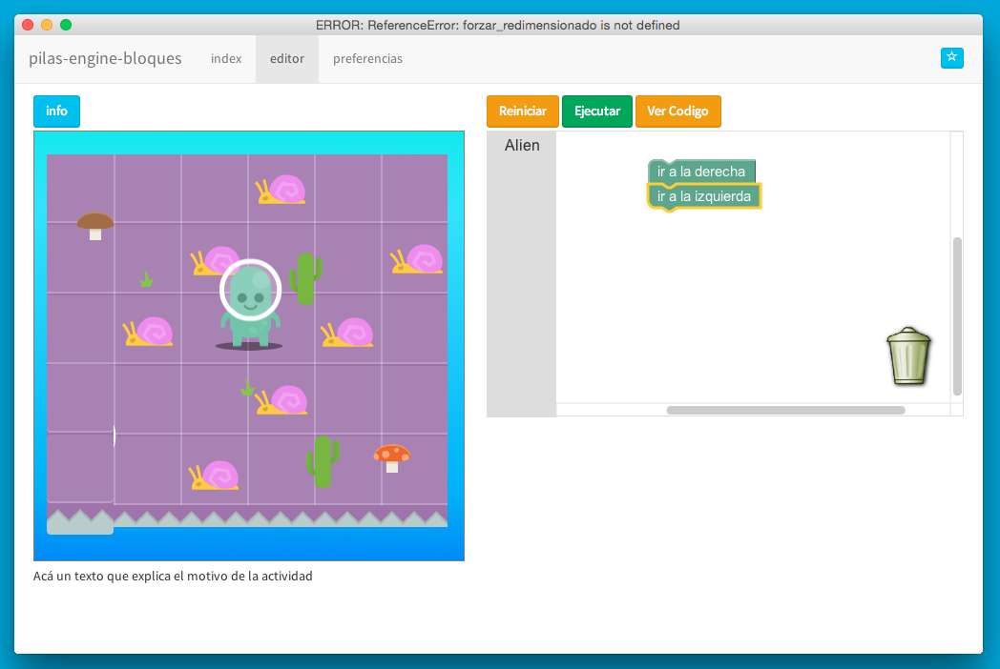

pilas-engine-bloques
====================

Una aplicación experimental para fomentar el aprendizaje
de la programación usando [pilas-engine](http://www.pilas-engine.com) y blockly.




Instalación para desarrolladores
--------------------------------

Primero tienes que ejecutar estos
comandos:

```
git clone http://github.com/hugoruscitti/pilas-engine-bloques
cd pilas-engine-bloques
npm install
bower install
```

Luego, invocando a ``make`` vas a ver los comandos mas comunes para utilizar. Aunque también vas a poder usar el comando ``ember`` o ``grunt`` para otros comandos.
