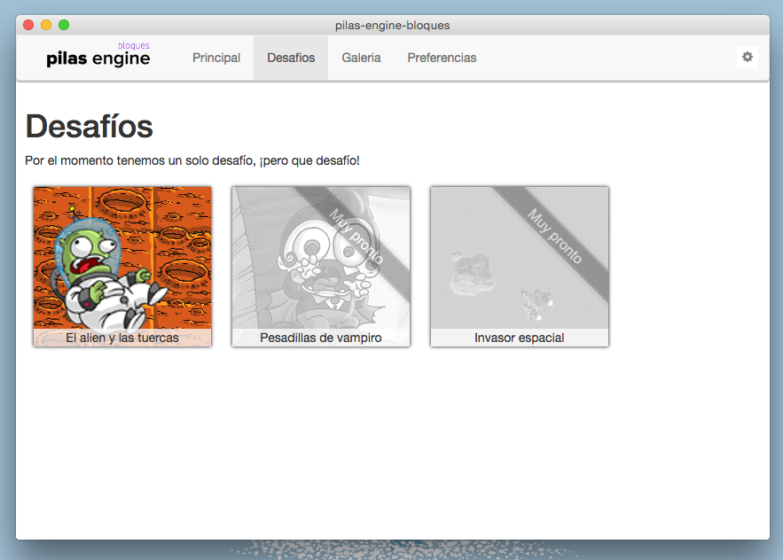
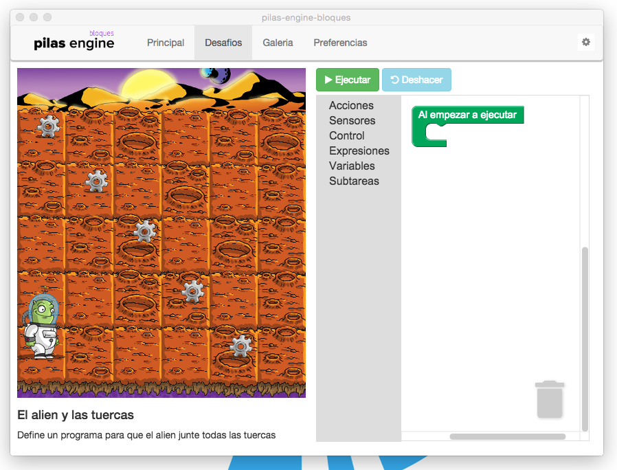

pilas-engine-bloques
====================

- Rama master: [](https://travis-ci.org/Program-AR/pilas-engine-bloques)
- Rama develop (principal): [](https://travis-ci.org/Program-AR/pilas-engine-bloques)

Esta es una versión hermana de [pilas-engine](http://www.pilas-engine.com.ar) pero
utilizando bloques, javascript y desafíos para aprender a programar.





¿Cómo empezar?
--------------

Al clonar el repositorio, podrías escribir el comando ``make``
para ver las tareas disponibles:


Por ejemplo, luego de clonar podrías completar todo el proceso ejecutando
estos comandos:

```
make iniciar
make full
make test_mac
```


Tests
-----

Para ejecutar los tests de la aplicación hay dos comandos principales, podemos ejecutar los tests de forma constante con este comando:

```
  make test
```

o ejecutar los test una sola vez usando el siguiente comando:


```
  ember nw:test
```
