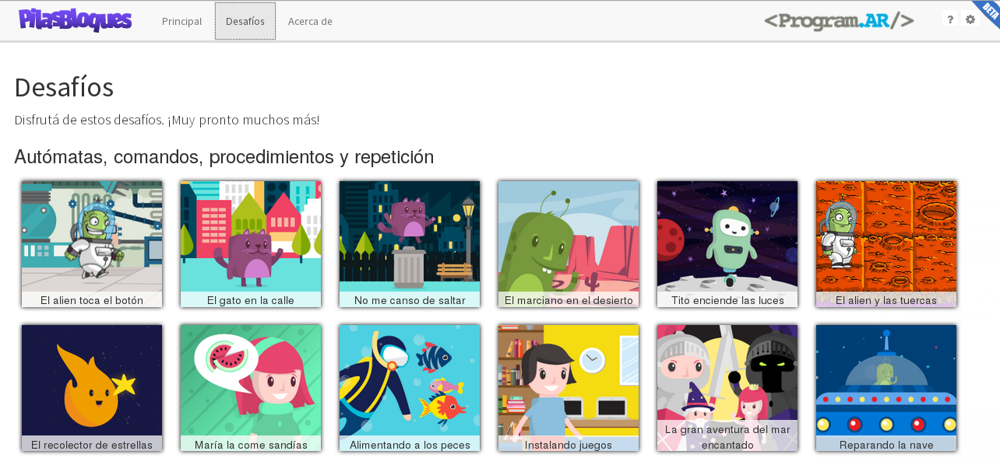

pilas-engine-bloques
====================

- Rama master: [](https://travis-ci.org/Program-AR/pilas-engine-bloques)
- Rama develop (principal): [](https://travis-ci.org/Program-AR/pilas-engine-bloques)

Esta es una versión hermana de [pilas-engine](http://www.pilas-engine.com.ar) pero
utilizando bloques, javascript y desafíos para aprender a programar.




¿Cómo empezar?
--------------

Al clonar el repositorio, podrías escribir el comando ``make``
para ver las tareas disponibles:


Por ejemplo, luego de clonar podrías completar todo el proceso ejecutando
estos comandos:

```
make iniciar
make full
make test_mac
```


Tests
-----

Para ejecutar los tests de la aplicación hay dos comandos principales, podemos ejecutar los tests de forma constante con este comando:

```
  make test
```

o ejecutar los test una sola vez usando el siguiente comando:


```
  ember nw:test
```

Notas de versión
---------
* 1.0.0
 * Incluye todos los desafíos hasta Parametrización Inclusive. Entonces, Pilas Bloques abarca todas las actividades del manual para docentes "La programación y su didáctica" sin el último capítulo (Interactividad).
 * Esto significa... ¡16 nuevas actividades! Con algunas mejoras respecto del manual para docentes. Por ejemplo, una mejora didácticamente importante es que ya no usamos strings.
 * ¡Ahora se pueden guardar soluciones a un archivo! (Y, por supuesto, cargar una solución desde un archivo)
 * Además, ahora Pilas Bloques se integra con una plataforma Moodle para dar soporte a cursos online.
 * Algunas mejoras visuales, como los tableros (en Reparando la nave ó El Superviaje).
 * Ahora los íconos de los bloques están todos al inicio del bloque.
 * También se corrigió la redacción de los mismos.
 * Ahora las dos primeras actividades de "Alternativa condicional" avisan con una flecha que hay que volver a ejecutar para probar en varios escenarios.
* 0.11.0
 * Incluye todos los desafíos hasta Uso de Variables inclusive.
 * En "La gran aventura del mar encantado" se optó por una alternativa de personajes
 con menos prejuicios sociales, intentando abogar por igualdad de géneros.
 ¡Es la heroína quien debe rescatar al príncipe!
 * Se cambiaron los nombres de las categorías de bloques, la discusión conceptual
 continúa.
 * Se arreglaron los enunciados de los desafíos.
 * Se arreglaron los tableros que muestran contadores.
 * Se mejoró la integración con Analytics. Ahora se hace seguimiento por desafío visitado.
* 0.10.0
 * Primer versión con todos los desafíos hasta Alternativa Condicional inclusive.
